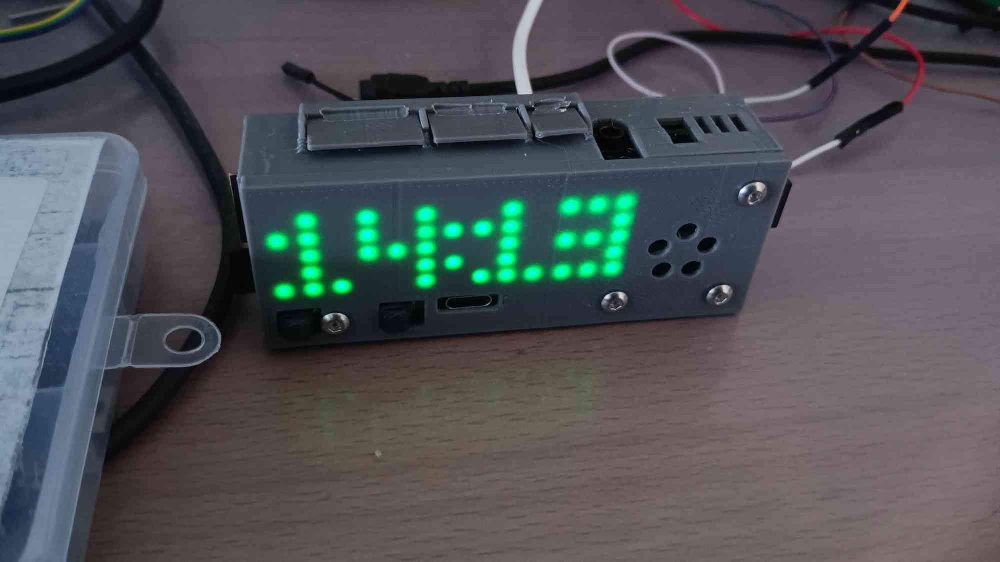
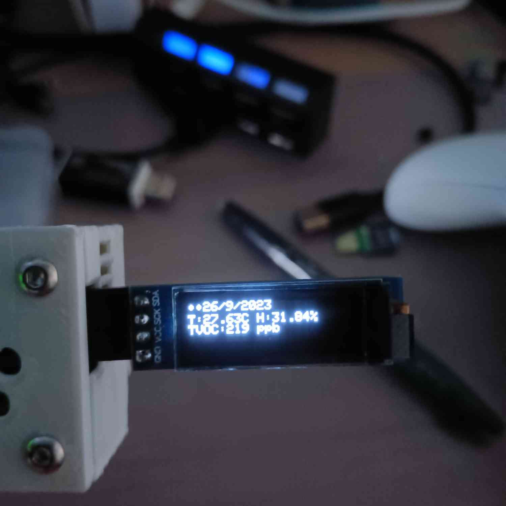
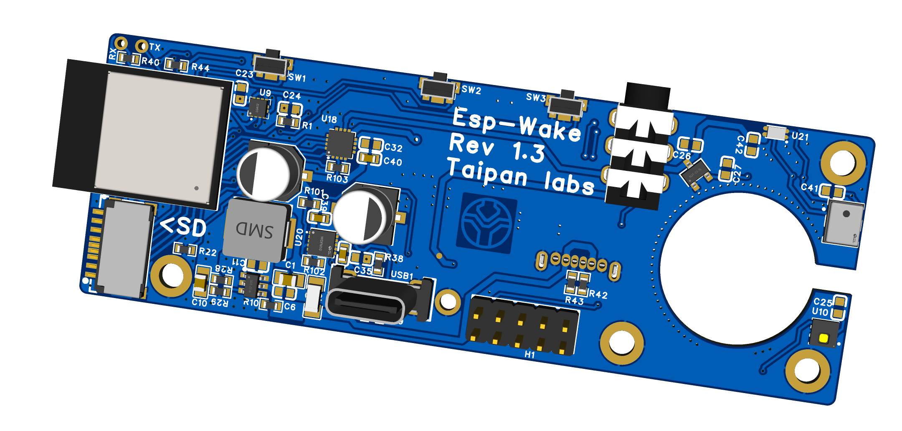
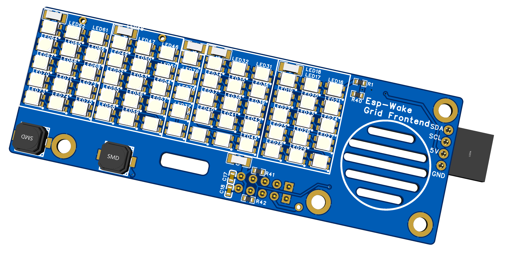

# Yorick geoffre's portfolio

Hi, my name is Yorick Geoffre and i'm a 4th year embedded enginerring student at UCA (université Clermont Auvergne), currently enrolled in the setsis master course (embedded systems for signal processing).   

This document is a portfolio detailing the most interesting projects i have completed over the years, as part of my studies or hobbies.

### note
you may see that a lot of my board are branded as being manufactured by "Taipan Labs", that is my maker name online, the boards were still all created by me.

## Table
- esp-wake, the simple iot alarm clock
- kamlibri, the compact usb camera platform
- piconaut, a microcontroller platform dedicated to AR/VR projects
- XRHS, an extended reality framework for linux
- OS.LL, an arm based linux laptop
- minimagick, an extremely cost-optimised IMU-based IK capture system for VR
- TScan, a better windows driver for industrial zebra scanners
- Logitron, a powerful logic analyzer based on the RP2040, compatible with sigrok and other standard tools.

### esp-wake
This project started when i finally had enough of my old brandt-brand alarm clock, which had various issues including overly strong lighting, poor sound quality and a general lack of connectivity.   

It's an esp32-S2 based alarm clock that can connect over wifi to sync with a time server, it also has a web server that can be used to set the various alarms for up to an entire month, and any music can be used as an alarm as long as it is loaded as a .wav file on its microSD card.

Optionnally, a 0.93 inch oled display can be connected to it's expansion port on the right, which will provide the user with the complete date as well as temperature, humidity, and air quality of the room in TVOC (the air quality changes the time LEDs's colors as well, from green to red to white).

Internally it has a dedicated low noise supply for the audio circuit which works over I2S using a MAX brand integrated DAC/Amp combo to get a clean and  glitch-less audio signal out, which is something that cheap audio players tend to fail to deliver on.

The micro SD can be used to store the temperature, humidity, light level and air quality data over time as well for metering. This alarm clock even has an accelerometer for detecting when you tap on your bedside table instead of fumbling to find the buttons in the dark to stop the alarm early in the morning...

It is fully open source and can be found completed at the following git repository:

https://github.com/Kanken6174/esp_wake

## Kamlibri
As i was developping XRHS, i found myself needing to buy more and more costly usb camera modules, on which i had absolutely no control as far as additionnal feautres or picture enhancement went. This is why i took it upon myself to create a compact usb camera system that i could actually build myself, for cheap, and in a sustainable way (that is with parts i know i could obtain in large quantities).

I looked through many different chip vendors before finally finding the one chip that met all my needs, the V851S from allwinner. It is a 4.5€/pc chinese arm A7-based microprocessor with 64mb of ram, which can run linux in headless mode, as well as connecting to various mipi-csi and parrallel-csi cameras. It also has a 1080p60 MJPEG encoder and a native usb 2.0 peripheral.

This device had all the building blocks that i needed in order to create my custom camera, i used it to create this first prototype, which was codenamed "lineye" (linux eye), and was sponsored by the UCA for board fabrication costs:

It was quite capable and was able to acquire its first images using a GC2053 (galaxycore brand) camera sensor:

The onboard ISP was especially useful to color and lens correct the various images. The one big issue with this design was its size, this was fixed with its next iteration, the kamlibri:

Now this board does work, it is a linux based board that's able to capture raw video footage from a wide variety of sensors, it can do picture enhancement as well as AI based feature detection thanks to its NPU, but there is one key element that's missing, the video encoder.   
This means that i'm forced to work with uncompressed RAW10 video, where each 1080p frame is around 6mb, which is wholly unuseable for a usb webcam. The hardware encoder is present on that chip but not in the open source SDK, only the proprietery SDK has it. To access it i would need to contact allwinner as a company and sign an NDA with them, which as an individual i'm not able to do, so i'm SOL on that front for now.

## Piconaut

Picontaut is a microcontroller board that is specifically meant to be used in AR/VR projects that need a fast MCU while staying fairly compact and cheap. It is based on the RP2040 and has:
- a BMI 270 6 axis IMU
- a QMC5833L 3 axis magnetometer
- a full charge and discharge BMS circuit (DW01A/TP4056)
- a highly efficient buck/boost converter circuit for battery power

It also has an expansion port on the back in the form of a microSD port, which lets you plug in a microSD card and talk to it over SPI, or connect a wide variety of microSD-shaped wireless modules, the one in the picture above is my ESP32C3-mini based module which has wifi and bluetooth.

The key feature of this mcu is its built in software library that handles all the filtering maths related to the IMU-MAG couple to output a clean eulerian angle, or a single quaternion. This lib also handles manual calibration of the system over a serial text communication.

## XRHS
XRHS, or eXtended Reality Helmet System, is both a hardware and software framework. It's a three-part system:

### the hardware
XRHS's hardware is only meant as a developpement platform for the software side and changes very often. In its current form it is a fully enclosed helmet which embarks an orange pi 5 ARM computer as well as custom optics and 1440x1440 screens, per eye.

note: in the above picture, the dev-link cable is plugged in, which is not usually present when in use (black usb-c cable)

the helmet can do:
- qr code detection and on-screen data display
- Heat vision, using an MLX90640 low res thermal sensor
- eye tracking, using the medusa boards and ir illuminators
- full, low latency video passthrough from the external cameras

The helmet has its own power source, which is an external battery pack you would usually wear on a belt or harness, it is able to output 2x5V at 20W each (one usb-c is for the orange pi 5, the other is for the axuiliary systems such as the screens and cameras):

The power supply has a few smart features, like power metering and remote shutdown, which can be accessed from the 4 pin connector on the right.

the quality of the onboard screens is quite good, giving the user a sharp image devoid of individual pixels, with little deformation or glare, and as a bonus the feild of view is very large, giving a high sense of immersion:

<video controls>
<source src="https://cdn.discordapp.com/attachments/733969551137570849/1142853394197917796/VID_20230820_110530.mp4?ex=65d22c2a&is=65bfb72a&hm=e274e1f97f051c3d8d4b5e38eeca0d05c3a22470566fe1c00dfb005a1b7bed99&"/>
</video>

using a rail attachement system, the optics can be quickly removed and cleaned or maintained. Without the use of any tools.

The battery system has two parts, a power module and a power cell. Each power cell can power the helmet for around 7-8 hours on light use. They're made with two 10AH lithium-polymer cells in parrallel, giving a final pack value of 20AH at 3.7V, that's a total of 74WH. Accounting for inefficiencies in the system, i measured a total efficiency of 94.7% on average, so 70WH total.   

Given that the orange pi 5 + screens consume around 14.5W on high load (gpu cpu and npu maxed out), you can excpect a full load battery life or around 70/14.5 ~= 4,83 hours or 4 hours and 49.8 minutes.   

Since the power cells can be swapped out, two of them could get you through a pretty intense day of use.   

The prcoessor of the orange pi 5, the onboard computer, is the RK3588S from rockchip, it is an 8 core, 2.2ghz cpu with a very powerful gpu for this class of SOC.

As you can see on this picture, when it is running the xrhs software the onboard computer only takes in about 9.5W, which is what you can excpect for most use cases. That means a total power draw of around 12W, which boosts the battery life to 5.8h hours.

### The software

## OS.LL
OS.LL or quite literally OpenSource LinuxLaptop, is as the name implies a linux based laptop project. Over the years i have gotten quite frustrated with the current state of laptops and chromebooks, they have a weak battery life, are hard to maintain and repair, and they tend to be almost impossible to customize to fit one's needs.

As i was developping the XRHS project, i started to really like the rockchip RK3588S processor as a very powerful and efficient arm based SOC. I bought another devboard based on this SOC which i use as a developper workstation for the XRHS project (using the same cpu means i don't have to deploy to the helmet to test changes). This little devboard is easily able to do most tasks a large x86 computer can, like:
- browsing the web
- watching 1080p60 videos
- editing, and compiling code

It is overall much more capable than the comparable raspberry pi boards. This made me want to be able to use it in a laptop-like format, as a low power and low cost developpement platform.

There are already commercial laptops built around the RK3588S, but they are very expensive (500€+) for what they are and they're generally manufactured by no-name chinese OEMs whom i do not trust with this type of hardware. This is why i started building my own from the ground up. 

At the very least laptop would need:
- a battery (i used 8 li-ion cells for that, as well as a custom battery pack manager circuit)

- a screen (a 15.6" 1080p EDP display was used here)
- a processor mainboard (this would be a carrier board for the RK3588s based radxa brand SOM)
- a power management board (this is the new polymaster board, which can charge and discharge the battery at up to 65W). Managing a 4 cell pack at these currents was especially difficult... not many ICs are meant to be used for this. I picked Texas instrument charging managers which are especially meant for laptop use.

- a keyboard (a custom low profile and tileable mechanical keyboard was made for this project)

So far the mainboard still isn't done, this is a work in progress. I'm trying to get the power stages to work properly first.

## Minimagick

This project was started because of a challenge given to me by the SlimeVR community. They were stating that a sub-5€ IMU based vr tracker was not possible, i felt like proving them wrong in a fun and useful way for everyone.

For context such trackers are strapped to a user's joints and they report on their own absolute angle, this enables the slimeVR software to recreate the user's skeleton in-game, giving them full body tracking for various VR games.

The current solutions for this software are based on the ESP8266 microcontroller, as well as an IMU of the user's choosing (usually a BMI160 or BNO085 on the high end), and a battery pack manager, the official modules look like this:

They're quite bulky and make use of proven but outdated technology (in my opinion), but that is a formula that works as they've sold a ton of these things over the years.

To get the cost down for my boards, i would have to cheap out on absolutely every component, without compromising on functionnality. I used a newer and very cheap IMU from STMicro, and instead of using an esp32, which sells for about 3€ a peice, i used a combination of a PUYA brand microcontroller, and a Ci2401 2.4ghz radio, which respectively sell for around 13 cents and 30 cents a peice at low volume.

Armed with these cheap but uncommon components i made these boards:

And their receiver:

I made extensive use of quite obscure chinese chips in this project to get the cost down, as i often do. Doing this lets me experiment in my personnal project to earn experience on what works and what doesn't. And here for example i've learnt that these WCH brand CH32V203 usb enabled MCUs are horrible for anything usb related, because no usb library supports them, and register-based usb management is a pain.

In the end the tracker's hardware was sound and passed all my tests. The final BOM cost of a single tracker was around 2.24€, way lower than the price limit given by the slimevr community. The fact that it uses that LSM IMU also makes it compatible with bosch's lineup of IMUs, which are more expensive but higher quality.

It's not all perfect though, not everyone might know this but there is a big caveat on the parts i've chosen here: this board absolutely CANNOT be sold as a product. Why you ask? Because of FCC and RED regulations that's why. If i wanted to make this into a product i would need to make this be certified by the FCC and RED, which costs around 10k to 15k usd. This is definitely not worth it over using modules, which is why this was only a fun little hardware experiment and i didn't bother to develop the software for these fully, as there would be no benefit in doing so.

## TScan

TScan, or trelleborg scan, is a peice of software i wrote during my intership in the industrial company Trelleborg AB. The site where i worked at had recently purchased 10 industrial scanners from dell which came in the form of ruggedized windows tablets. These cost around 1500€ each with the scanner modules installed on their back. So that was a 15K usd investement for the company, you would excpect the tablet's manufacturer (dell) to provide good software support for such an expensive product... but you'd be wrong.

So apparently the driver dell made for the zebra-brand scanner was bugged out on all versions, each with a different problem, our current one was the each scanned characters would come out one by one, each one taking a second. This was wholly unaccepteable as it broke all our scanner logic and took forever to complete a single scan.

After some frustrating back-and-forth with the dell support, my manager at the company handed me over the subject and i started working on it. I immediately removed any dell software on the device to avoid issues, and contacted zebra to obtain their sdk for these specific OEM scanner modules. They were thankfully very quick to respond and open to giving me the software i needed without any extra NDAs to sign, unlike *some* companies...

I then developped a new windows driver based on that sdk, and within 2 weeks we had an in-house software solution for these scanners which was very stable and met our needs, the solution was greenlit by our production testers and deployed within the month the issue arose. Needless to say the dell driver was still broken when i ended my internship... I can't show the driver code to anyone as it is currently closed source and trelleborg's property, but that was a fun embedded/system software project i had to take on.

## Logitron

Logitron is a custom logic analyzer project i made to help me figure out various digital logic issues in my prjects. This kind of instrument can cost a lot of money, especially at high frequencies. The Logitron is based on the RO2040 microcontroller made by raspberry pi. It is a highly versatile mcu which has two cores at 133mhz, and PIOs (programmable I/Os), which are invaluable in this project for their capacity to quickly acquire and send out digital data.

